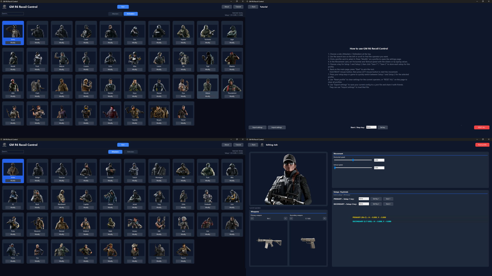

# GM R6 Recoil Control

A Windows desktop tool for creating **per-operator recoil profiles** for Rainbow Six Siege.  
You can save two setups per operator, bind them to keys, and trigger smooth mouse movements using a **Right-Click + Left-Click** combo.

---

## ✨ Features

- 🎯 **Per-operator profiles**
  - Separate lists for **Attackers** and **Defenders**
  - Built-in profiles for all operators (Sledge, Ash, Jäger, etc.)
  - Each profile has its own saved recoil values & keybinds

- ⚙️ **Two setups per operator (per weapon)**
  - **Setup 1** → typically for your **primary weapon**
  - **Setup 2** → typically for your **secondary / second weapon**
  - Each setup has:
    - Horizontal speed  
    - Vertical speed  
    - A dedicated hotkey

- ⌨️ **Hotkey-based switching**
  - Assign any key to Setup 1 / Setup 2
  - Press the key in-game to instantly switch recoil setup for the selected operator

- 🖱 **Mouse combo activation**
  - Toggle the tool **ON/OFF** with the **Start** button
  - When active:
    - Hold **Right Mouse Button**
    - Then press and hold **Left Mouse Button**
    - The tool sends relative mouse movement using `SendInput`, so games see it as real input

- 🖼 **Modern UI**
  - Dark themed WinForms UI
  - Operator cards with thumbnails
  - Search bar and Attackers/Defenders tabs
  - Detailed Settings page with:
    - Live operator preview
    - Movement sliders & textboxes
    - Setup & keybind overview

- 💾 **Persistent settings**
  - All speeds & keybinds are saved to `profiles.json`
  - Automatically loaded next time you run the app

---

## 🧩 How It Works (Short Version)

- The app runs a timer (every 20 ms) and:
  - Checks your **mouse buttons** globally via `GetAsyncKeyState`
  - When the **Right + Left** combo is active:
    - It accumulates horizontal & vertical deltas
    - Sends them as **relative mouse movement** using `SendInput`
- Each operator/profile has:
  - `Horizontal1 / Vertical1` + `Key1`  → Setup 1 (usually primary weapon)
  - `Horizontal2 / Vertical2` + `Key2`  → Setup 2 (usually second weapon)
- Pressing `Key1` or `Key2` switches which setup is active for the current operator.

---
> ⚠️ **Disclaimer**   
> Use at your own risk and only where it’s allowed (e.g. offline, custom games, testing).

